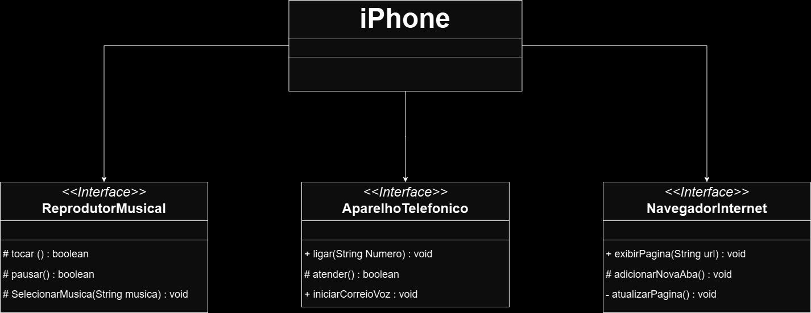

# Projeto UML baseado no Iphone

- Interfaces Java
- Programação Orientada a Objetos com Java
- 3 interfaces usadas como:
  1. Reprodutor de música, possibilitando reproduzir, pausar e selecionar músicas.
  2. Telefone, possibilitando a ação de ligar e atender uma chamada telefônica ou iniciar um correio de voz.
  3. Navegador de internet, possibilitando a exibição e a atualização de uma página ou adicionando uma nova aba.

UML do programa em java:

Diagrama UML criado usando o site [drawio](www.drawio.com).